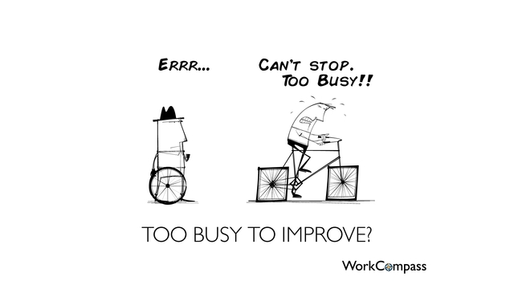

# Quick Retrospective

## Bowling Game

| Team | Date |
| ---- | ---- |
| XXX | MM/DD/YYYY |

## DO
_`What did we do?`_

- 
-

## LEARN
_`What did we learn?`_

-
-

## PUZZLE
_`What still puzzles us?`_

-
-

## DECIDE
_`How can we apply this in the future?`_

-
-

_By [Alan O'Rourke](https://www.flickr.com/people/33524159@N00), under [Creative Commons Attribution 2.0 Generic](https://creativecommons.org/licenses/by/2.0/deed.en) license, for [www.workcompass.com/](http://www.workcompass.com/). More details on [Wikipedia Commons](https://commons.wikimedia.org/wiki/File:Too_Busy_To_Improve_-_Performance_Management_-_Square_Wheels.png)_
