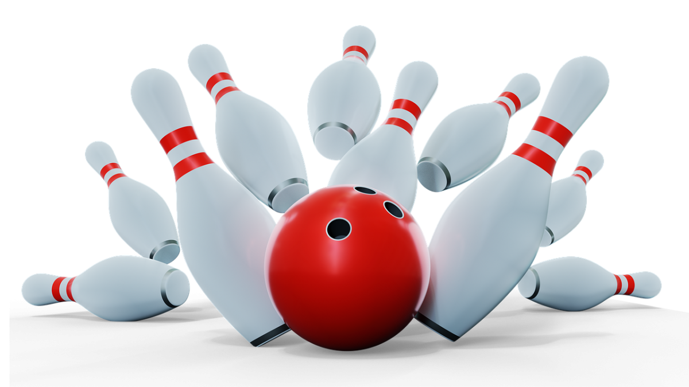

# Bowling Game Kata

  
"[Bowling Strike Bullet Isolated](https://pixabay.com/illustrations/bowling-strike-bullet-isolated-3d-3427969/)" by [MasterTux](https://pixabay.com/fr/users/mastertux-470906/) is licenced under [Pixabay License](https://pixabay.com/fr/service/license/)

## Description

Available [here](http://codingdojo.org/kata/Bowling/)

## Getting Started

- [C++](cpp/GETTING_STARTED.md)
- [C#](csharp/GETTING_STARTED.md)
- [Elixir](elixir/GETTING_STARTED.md)
- [Go](go/GETTING_STARTED.md)
- [Java](java/GETTING_STARTED.md)
- [PHP](php/GETTING_STARTED.md)
- [Python](python/GETTING_STARTED.md)
- [Rust](rust/GETTING_STARTED.md)
- [Typescript](typescript/GETTING_STARTED.md)

## Session Quick Retrospective

You can fill it from [here](QuickRetrospective.md)

## Useful Links

### For this Kata

- [Acceptance Test Example 1](http://www.labviewcraftsmen.com/blog/bowling-kata-unit-test-framework#)
- [Acceptance Test Example 2](http://slocums.homestead.com/gamescore.html)
- [Online Bowling Score Calculator](http://www.bowlinggenius.com/)

### General

- [TCR (Test && Commit || Revert) wrapper](tcr/TCR.md) utility
- Collaborative timer for pairing or mobbing:
  [mobti.me](https://mobti.me/)
  or [agility timer](https://agility.jahed.dev/)

## Session Information

### Style & Duration

- 2-hour [Prepared Kata](doc/PreparedKata.md)

### Topic

- Basic TDD

### Focus Points

- Red-Green-refactor
- Baby Steps
- YAGNI

### Source Files

- [C++](cpp)
- [C#](csharp)
- [Elixir](elixir)
- [Go](go)
- [Java](java)
- [PHP](php)
- [Python](python)
- [Rust](rust)
- [Typescript](typescript)

## License

`Kata-BowlingGame` and the accompanying materials are made available
under the terms of the [MIT License](LICENSE.md) which accompanies this
distribution, and is available at the [Open Source site](https://opensource.org/licenses/MIT)

## Acknowledgements

See [ACKNOWLEDGEMENTS.md](ACKNOWLEDGEMENTS.md) for more information.

## Contributors

<table>
<tr>
    <td align="center" style="word-wrap: break-word; width: 150.0; height: 150.0">
        <a href=https://github.com/mengdaming>
            
             
            <b>Damien Menanteau</b>
        </a>
    </td>
    <td align="center" style="word-wrap: break-word; width: 150.0; height: 150.0">
        <a href=https://github.com/philou>
            
             
            <b>Philippe Bourgau</b>
        </a>
    </td>
    <td align="center" style="word-wrap: break-word; width: 150.0; height: 150.0">
        <a href=https://github.com/aatwi>
            
             
            <b>Ahmad Atwi</b>
        </a>
    </td>
    <td align="center" style="word-wrap: break-word; width: 150.0; height: 150.0">
        <a href=https://github.com/AntoineMx>
            
             
            <b>AntoineMx</b>
        </a>
    </td>
</tr>
</table>

## Additional Contributors

### For providing initial setup for C#

<table>
<tr>
    <td align="center" style="word-wrap: break-word; width: 150.0; height: 150.0">
        <a href=https://github.com/Tr00d>
            
             
            <b>Guillaume Faas</b>
        </a>
    </td>
