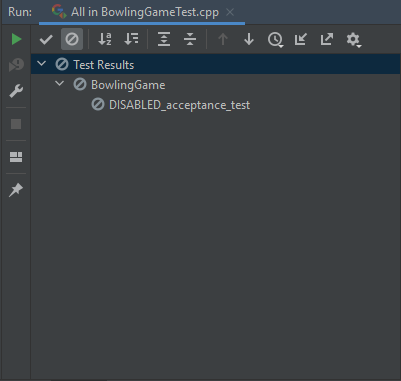

# Getting Started with Bowling Game kata in C++

## Prerequisites 

### Build Tools 

[CMake](https://cmake.org/) is our main build tool for the C++ version of this Kata.

Don't worry if you don't have CMake installed! 
We provided you with a setup script that handles compiling and building the project. 
 
### Required Versions 

#### C++ 

By default, our CMake file is referencing C++ version 17. But, we also tested and 
compiled the code with versions 11 and 14. 

To use a version other than 17, simply modify the below line in the [CMake](./CMakeLists.txt)
file to reference 11 or 14.  

```shell
set(CMAKE_CXX_STANDARD 17)
```

#### CMake
The minimum required version of CMake is "***3.19.3***". 

However, in our setup script, we are using the version "***3.21.0***"

#### Compilers 

When running on Windows, the code is compiled with [MSVC](https://docs.microsoft.com/en-us/cpp/build/reference/compiling-a-c-cpp-program?view=msvc-160). 

On other platforms, the script will be using the default C++ compiler set on the machine. 
For that, we have tested the with GCC and Clang

### IDEs 
We have successfully tested loading, compiling and running this kata on the below 4 IDEs: 
1. [Microsoft Visual Studio](https://visualstudio.microsoft.com/)
1. [Xcode](https://developer.apple.com/xcode/)
1. [Visual Studio Code](https://code.visualstudio.com/)
1. [CLion](https://www.jetbrains.com/clion/)

***Note:*** 

1. When executed on Windows and macOS, our script will, by default, generate the solution files ***Kata-BowlingGame.sln*** for **'Visual Studio 2017'** & ***Kata-BowlingGame.xcodeproj*** for **'Xcode'** respectively. 
1. The script doesn't generate the VSCode or CLion Workspace files. However, loading and running the project into VSCode or CLion is straight forward. 
   1. For VSCode, you can check the tutorial '[Getting started with CMake Tools on Linux](https://code.visualstudio.com/docs/cpp/cmake-linux#:~:text=ready%20to%20build.-,Open%20the%20Command%20Palette%20(Ctrl%2BShift%2BP)%20and,CMake%20Tools%20builds%20all%20targets.)' for reference. 

## Running the Kata 

Before running the kata in your IDE, you need to run CMake in order to generate the Solution Files

> ***Reminder***:  You need to run the commands below from the [cpp](.) folder!

### Build Steps
#### Manual Build  

If you already have CMake installed on your machine, you can simply run one of the below commands to build the project. 

```shell
# For Visual Studio 2017 
> cmake -G "Visual Studio 15 2017 Win64" -S . -B build

# For XCode  
> cmake -G "XCode" -S . -B build

# For Linux (Visual Studio Code)
> cmake -G "Unix Makefiles" -S . -B build
```

#### Setup Script 

As mentioned earlier, we prepared a setup script to assist you in compiling and building the project. 

You can run the script using the below commands: 

```shell
# macOS, Linux & Windows (Git Bash)
> ./cpp_easy_setup.sh

# Windows (PowerShell or CMD)
> ./cpp_easy_setup.bat
```

If executed successfully, the last 3 lines of the output should be the following: 

```shell
    Start 1: ctest-Kata-BowlingGame
1/1 Test #1: ctest-Kata-BowlingGame ...........   Passed    1.21 sec

100% tests passed, 0 tests failed out of 1
```

### Expected Folder Structure

After running any of the above steps, the following folders and files should be generated:
1. A [build](./build) folder that includes the files generated from running CMake.
1. For *Windows*: The **'Visual Studio 2017'** solution file [Kata-BowlingGame.sln](./build/Kata-BowlingGame.sln)
1. For *macOS*: The **'Xcode'** project file [Kata-BowlingGame.xcodeproj](./build/Kata-BowlingGame.xcodeproj)

### Using IDEs 

The CMake file we provided generates the target 'Kata-BowlingGame-test' that defines the test location(i.e. [BowlingGameTest.cpp](./test/BowlingGameTest.cpp)). 

#### Visual Studio 2017

You can open the project in VS 2017, by simply running the solution file [Kata-BowlingGame.sln](./build/Kata-BowlingGame.sln)

After loading the project into your IDE: 
1. Make sure the 'Kata-BowlingGame-test' project is set as the StartUp Project then run the project. 
1. Run the project (in VS use '**F5**' or click on '**Local Window Debugger**' in the toolbar). The following output should be generated: 
	```shell
	Running main() from .../Kata-BowlingGame/cpp/build/_deps/googletest-src/googletest/src/gtest_main.cc
	[==========] Running 0 tests from 0 test suites.
	[==========] 0 tests from 0 test suites ran. (2 ms total)
	[  PASSED  ] 0 tests.

	  YOU HAVE 1 DISABLED TEST
	```
1. You can also use the 'Test Explorer' window to run and view all the executed tests 

	

#### CLion

CLion is an alternative to using Visual Studio 2017.

Here are the steps you need to follow: 
1. Start CLion and open the project from the 'cpp' folder. 
1. CLion should automatically build the CMake file. 
1. Run the test file [BowlingGameTest.cpp](./test/BowlingGameTest.cpp).
1. Below is a snapshot of the expected Test Explorer 
   
   
