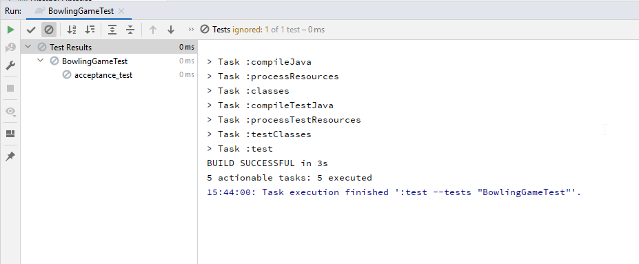

# Getting Started with Bowling Game kata in Java

## Prerequisites

### Build Tools

We provided the necessary to build the project with either [Maven](https://maven.apache.org/)
or [Gradle](https://gradle.org/)!

Please ensure that you have at-least one of them installed on your machine.

### Java Version
The source code of this project is compatible with [Java-11](https://www.oracle.com/java/technologies/javase-downloads.html#JDK11) and above.
In the [pom.xml](pom.xml) and [build.gradle](build.gradle), you can notice that the source version
has been set to 11. Remember to change that configuration to your preferred version if needed.

### IDEs
We are using [IntelliJ](https://www.jetbrains.com/idea/), but you can choose any IDE that
supports loading Maven or Gradle projects!

## Running the Kata

> ***Reminder***:  You need to run the commands below from the [java](.) folder!

To build and run the project, you can either use the build features in IntelliJ
or the Maven & Gradle build command lines (as shown below):

### IntelliJ

After loading the project into IntelliJ, you should be able to build the project
using either the Maven or Gradle built-in build tools.

To run the application from IntelliJ, run all the tests in the [BowlingGameTest](./src/test/java/com/murex/BowlingGameTest.java) 
class. 

The "**Run**" tool window should display all the executed tests.
Below is a snapshot of what you should expect from the first execution:



### Maven
To build and run the tests using maven, use the following: 
```shell
> ./mvnw clean install 
```

If executed successfully, the above command should generate the following test report in the command line:
```shell
[INFO] -------------------------------------------------------
[INFO]  T E S T S
[INFO] -------------------------------------------------------
[INFO] Running BowlingGameTest
[WARNING] Tests run: 1, Failures: 0, Errors: 0, Skipped: 1, Time elapsed: 0.045 s - in BowlingGameTest
[INFO]
[INFO] Results:
[INFO]
[WARNING] Tests run: 1, Failures: 0, Errors: 0, Skipped: 1
[INFO]
[INFO]
[INFO] --- maven-jar-plugin:3.2.0:jar (default-jar) @ Kata-BowlingGame ---
```

### Gradle
To build and run the tests using gradle, use the following:
```shell
# Windows  
> ./gradlew.bat clean build

# Mac & Linux
> ./gradlew clean build
```

If executed successfully, the above command should generate the following:
```shell
> ./gradlew clean build

BUILD SUCCESSFUL in 3s
7 actionable tasks: 7 executed
```
